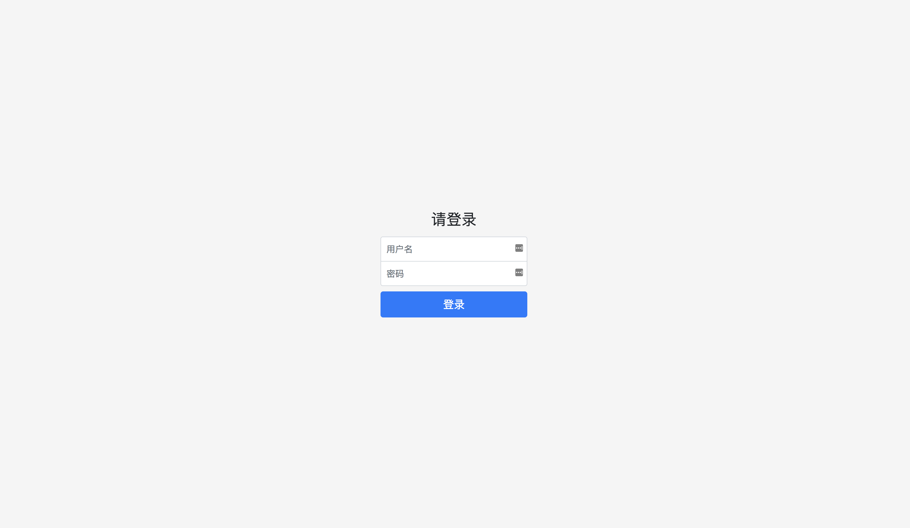
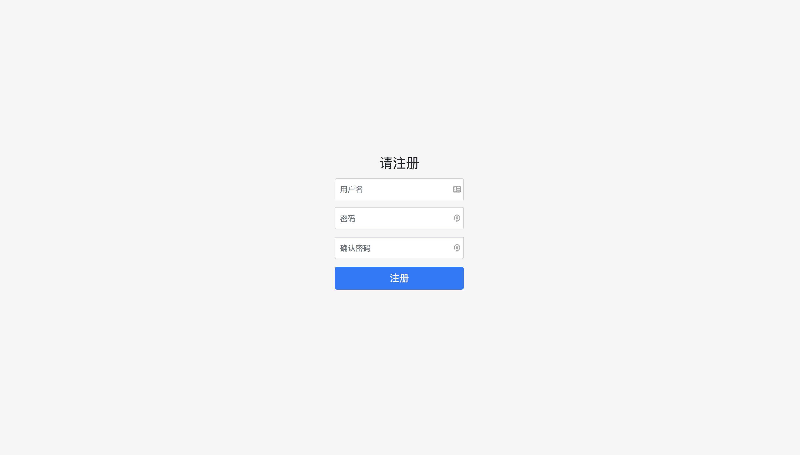
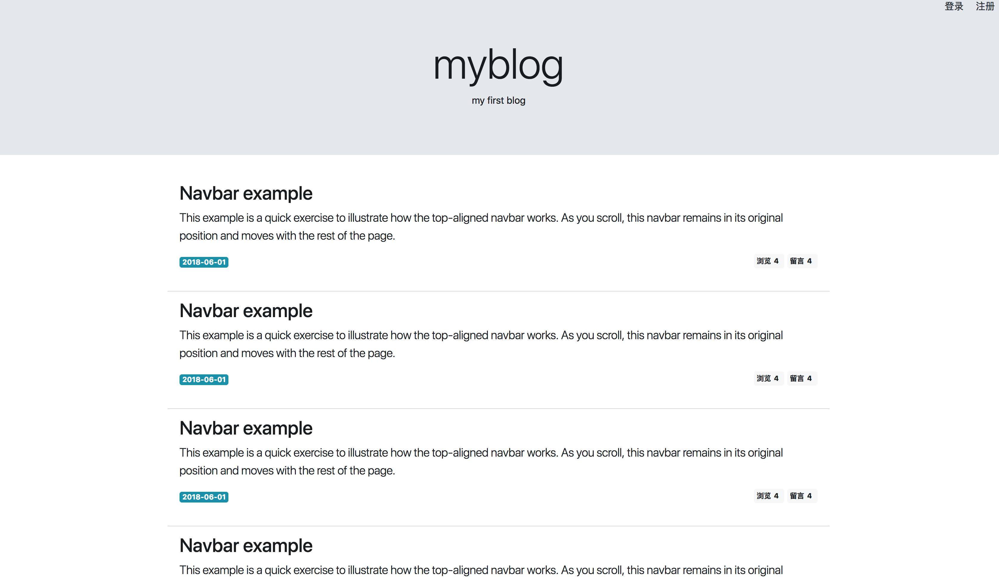

# myblog

一个 node 学习中...的项目

谢谢大牛（@nswbmw）发布在 GitHub 的项目，让我学到了很多...

## 项目初始化

使用 `Express 应用生成器`快速创建一个项目

```bash
express myblog
cd myblog
yarn install
atom ./
```

Express 应用生成器添加的依赖模块

1.  `cookie-parser`：cookie 中间件
2.  `debug`
3.  `ejs`：模板引擎
4.  `express`：web 框架
5.  `http-errors`：
6.  `morgan`：日志模块

## 启动项目

使用 `supervisor` 启动项目

```bash
cd myblog
supervisor bin/www
```

然后，浏览器访问 URL:
`localhost:3000`

## 目录结构

```bash
├── app.js                # 启动文件，或入口文件
├── bin                   # 存放可执行文件
│   └── www
├── package.json          # 项目信息和模块依赖
├── public                # 存放静态资源
│   ├── images
│   ├── javascripts
│   └── stylesheets
│       └── style.css
├── routes                # 存放路由文件
│   ├── index.js
│   └── users.js
└── views                 # 存放视图文件
    ├── error.ejs
    └── index.ejs
```

## 安装项目依赖模块

```bash
yarn add config-lite connect-flash connect-mongo express-formidable express-session marked moment mongolass objectid-to-timestamp sha1 winston express-winston
```

模块说明：

1.  `express-session`：session 中间件
2.  `connect-mongo`：结合 express-session 使用，将 session 存储到 mongodb
3.  `connect-flash`：页面通知中间件，基于 session 实现
4.  `express-formidable`：接收表单及文件上传的中间件
5.  `config-lite`: 读取配置文件
6.  `marked`: markdown 解析
7.  `moment`: 时间格式化
8.  `mongolass`: mongodb 驱动
9.  `objectid-to-timestamp`: 根据 ObjectId 生成时间戳
10. `sha1`: sha1 加密，用于密码加密
11. `winston`: 日志
12. `express-winston`: express 的 winston 日志中间件

## 配置文件与代码分离

```bash
# myblog 目录下
mkdir config
touch default.js
```

`default.js`

```javascript
module.exports = {
  port: 3000, // 端口
  session: {
    // express-session 的配置信息
    secret: "myblog",
    key: "myblog",
    maxAge: 1000 * 60 * 60 * 24 * 30
  },
  mongodb: "mongodb://localhost:27017/myblog" // mongodb 的地址，myblog 为数据库名
};
```

## 设置加载 session 中间件

`app.js`

```javascript
// 引入 express-session 和 connect-mongo 模块
const session = require("express-session");
const MongoStore = require("connect-mongo")(session);
// 引入 config-lite，读取配置文件
const config = require("config-lite")(__dirname);

// ...... 加载解析 cookie 中间件

// 加载 session 中间件
app.use(
  session({
    name: config.session.key, // 设置 cookie 中保存 session ID 的字段名
    secret: config.session.secret, // 设置 secret，来生成 signedCookie，即加密
    resave: true, // 强制更新 session
    saveUninitialized: false, // 强制创建一个 session，即使用户未登录
    cookie: { maxAge: config.session.maxAge }, // 设置 cookie 过期时间
    store: new MongoStore({
      // 将 session 存储到 mongodb 中
      url: config.mongodb
    })
  })
);
```

## flash

`app.js`

```javascript
const flash = require("connect-flash");

// flash 中间件，用来显示通知
app.use(flash());
```

## 功能与路由设计

`Restful` 以后再考虑……

1.  注册
    1.  注册页：`GET /signup`
    2.  注册（包含上传头像）：`POST /signup`
2.  登录
    1.  登录页：`GET /signin`
    2.  登录：`POST /signin`
3.  登出：`GET /signout`
4.  查看文章
    1.  主页：`GET /posts`
    2.  个人主页：`GET /posts?author=xxx`
    3.  查看一篇文章（包含留言）：`GET /posts/:postId`
5.  发表文章
    1.  发表文章页：`GET /posts/create`
    2.  发表文章：`POST /posts/create`
6.  修改文章
    1.  修改文章页：`GET /posts/:postId/edit`
    2.  修改文章：`POST /posts/:postId/edit`
7.  删除文章：`GET /posts/:postId/remove`
8.  留言
    1.  创建留言：`POST /comments`
    2.  删除留言：`GET /comments/:commentId/remove`

## 添加路由

新建文件：

```bash
# myblog 目录下

cd routes
touch signup.js signin.js signout.js posts.js
cd ../views
touch signup.ejs signin.ejs signout.ejs posts.ejs
```

`app.js`

- ~~var indexRouter = require("./routes/index");~~
- ~~var usersRouter = require("./routes/users");~~

修改为：

```javascript
// 引入路由
const routes = require("routes/index");
```

- ~~app.use("/", indexRouter);~~
- ~~app.use("/user", usersRouter);~~

修改为：

```javascript
// 设置路由控制器
routes(app);
```

`routes/index.js`

- ~~var express = require('express');~~
- ~~var router = express.Router();~~

- ~~/_ GET home page. _/~~
- ~~router.get('/', function(req, res, next) {~~
- ~~res.render('index', { title: 'Express' });~~
- ~~});~~

- ~~module.exports = router;~~

修改为：

```javascript
const signInRouter = require("./signin");
const signUpRouter = require("./signup");
const signOutRouter = require("./signout");
const postsRouter = require("./posts");

module.exports = function(app) {
  app.get("/", function(req, res) {
    res.render("index", { title: "Express" });
  });
  app.use("/signin", signInRouter);
  app.use("/signup", signUpRouter);
  app.use("/signout", signOutRouter);
  app.use("/posts", postsRouter);
};
```

`signin.js`

```javascript
const express = require("express");
const router = express.Router();

router.get("/", function(req, res) {
  res.render("signin", {});
});

module.exports = router;
```

`signup.js`

```javascript
const express = require("express");
const router = express.Router();

router.get("/", function(req, res) {
  res.render("signup", {});
});

module.exports = router;
```

`signout.js`

```javascript
const express = require("express");
const router = express.Router();

router.get("/", function(req, res) {
  res.redirect("signin");
});

module.exports = router;
```

`posts.js`

```javascript
const express = require("express");
const router = express.Router();

router.get("/", function(req, res) {
  res.render("posts", {});
});

module.exports = router;
```

## 页面设计

`登录页面`



`注册页面`



`主页`



## 新建样式和 ejs 模板文件

`public/stylesheets/style.css`

```css
html,
body {
  height: 100%;
  width: 100%;
}
header {
  text-align: center;
}
.signin-body {
  display: -ms-flexbox;
  display: -webkit-box;
  display: flex;
  -ms-flex-align: center;
  -ms-flex-pack: center;
  -webkit-box-align: center;
  align-items: center;
  -webkit-box-pack: center;
  justify-content: center;
  padding-top: 40px;
  padding-bottom: 40px;
  background-color: #f5f5f5;
}
.form-signin,
.text-center {
  width: 100%;
  max-width: 330px;
  padding: 15px;
  margin: 0 auto;
}
.form-label-group {
  position: relative;
  margin-bottom: 1rem;
}
.form-signin .form-control {
  position: relative;
  box-sizing: border-box;
  height: auto;
  padding: 10px;
  font-size: 16px;
}
.form-signin .form-control:focus {
  z-index: 2;
}
.form-signin input[type="text"] {
  margin-bottom: -1px;
  border-bottom-right-radius: 0;
  border-bottom-left-radius: 0;
}
.form-signin input[type="password"] {
  margin-bottom: 10px;
  border-top-left-radius: 0;
  border-top-right-radius: 0;
}
.setting {
  position: absolute;
  width: 100%;
  top: 0;
  text-align: right;
}
.article-footer {
  text-align: right;
  margin-top: -26px;
}
```

`views/header.ejs`

```html

```

`views/footer.ejs`

```html

```

`views/components/setting.ejs`

```html

```

`views/index.ejs`

```html

```

`views/signin.ejs`

```html

```

`views/signup.ejs`

```html

```

`views/posts.ejs`

```html

```

## app.locals 和 res.locals

`app.js`

```javascript
// 引入 package，用于设置全局常量
const pkg = require("./package");

// 设置模板全局常量
// ps. 要放在路由 routes 前面
app.locals.blog = {
  title: pkg.name,
  description: pkg.description
};
// 添加模板必需的三个变量
// ps. 要放在路由 routes 前面
app.use(function(req, res, next) {
  res.locals.user = req.session.user;
  res.locals.success = req.flash("success").toString();
  res.locals.error = req.flash("error").toString();
  next();
});
```

## 连接数据库

`mongodb/db.js`

```javascript
import mongoose from "mongoose";
import config from "config-lite";

mongoose.connect(config.mongodb);
mongoose.Promise = global.Promise;

const db = mongoose.connection;

db.once("open", () => {
  console.log("数据库连接成功！");
});

db.on("error", () => {
  console.error(`Error in Mongodb ${error}`);
  mongoose.disconnect();
});
```

## 注册

### 用户模型

`models/user.js`

```javascript
const mongoose = require("mongoose");

const Schema = mongoose.Schema;

const userSchema = new Schema({
  name: String,
  password: String,
  email: String,
  meta: {
    createAt: {
      type: Date,
      default: Date.now
    },
    updateAt: {
      type: Date,
      default: Date.now
    }
  }
});

const User = mongoose.model("User", userSchema);

module.exports = User;
```
